.. role:: red-text

########################################
Configuring NOAA Cloud Service Providers
########################################

The NOAA Cloud Service Providers (CSP) support the forecast-only,
coupled, and gefs configurations for the global workflow.
Once a suitable CSP instance and cluster is defined/created,
the global-workflow may be executed similar to the on-prem machines.
Currently the global-workflow supports the following
instance and storage types as a function of CSP and forecast
resolution.

.. list-table::
   :widths: auto
   :header-rows: 1
   :align: center

   * - **Cloud Service Provider**
     - **Global Workflow Resolution**
     - **Global Workflow Application**
     - **Instance Type**
     - **Partition**
     - **File System**
   * - Amazon Web Services Parallel Works
     - C48, C96, C192, C384
     - ``ATM``, ``GEFS``
     - ``c5.18xlarge (72 vCPUs, 144 GB Memory, amd64)``
     - ``compute``
     - ``/lustre``, ``/bucket``
   * - Azure Parallel Works
     - C48, C96, C192, C384
     - ``ATM``, ``GEFS``
     - ``Standard_F48s_v2 (48 vCPUs, 96 GB Memory, amd64)``
     - ``compute``
     - ``/lustre``, ``/bucket``
   * - GCP Parallel Works
     - C48, C96, C192, C384
     - ``ATM``, ``GEFS``
     - ``c3d-standard-60-lssd (60 vCPUs, 240 GB Memory, amd64)``
     - ``compute``
     - ``/lustre``, ``/bucket``

Instructions regarding configuring the respective CSP instance and
cluster follows.

*********************
Login to the NOAA CSP
*********************

Log in to the `NOAA CSP <http://noaa.parallel.works/login>`_ and into
the resources configuration. The user should arrive at the following
screen. Click the "blue" box pointed by the red arrow to login.

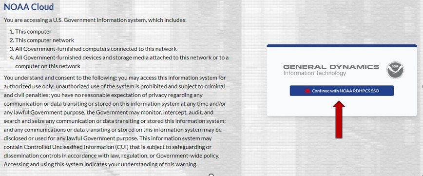

Fill the ``Username / Email`` box with your own username or NOAA-email.
Note that the ``Username or email`` query is case-sensitive.
And then the respective RSA token key using the same application used
for the other RDHPCS machines (i.e., Hera, Jet, etc.,).

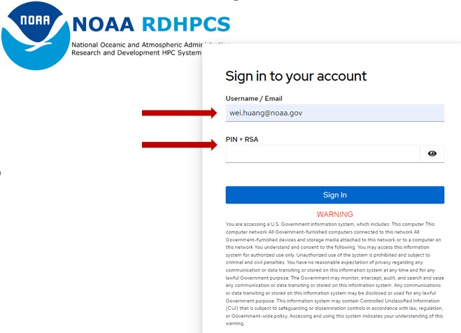

*******************************
Configure the NOAA CSP Instance
*******************************

Once logged into the NOAA CSP, navigate to the :red-text:`Marketplace` section
at the left panel as pointed by the red arrow, and click.
Scrow down to selecet "AWS EPIC Wei CentOS" as in red-circle.
Note, current global-workflow still using CentOS built spack-stack.
It will be updated to Rocky 8 soon.

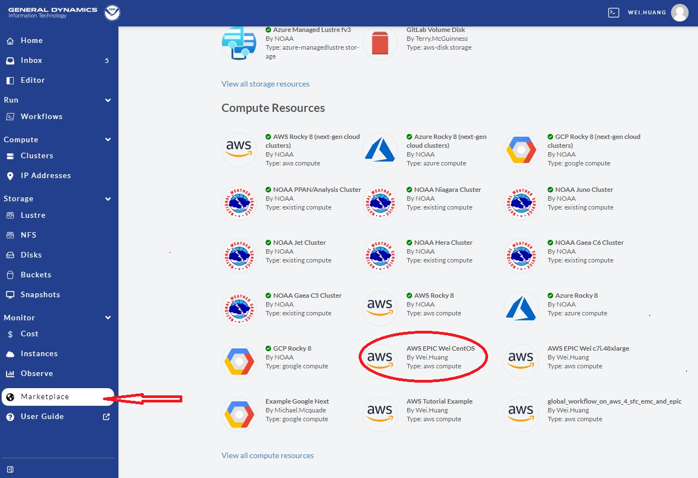
   
Next, click "Forklatest" as shown in the red-circle.

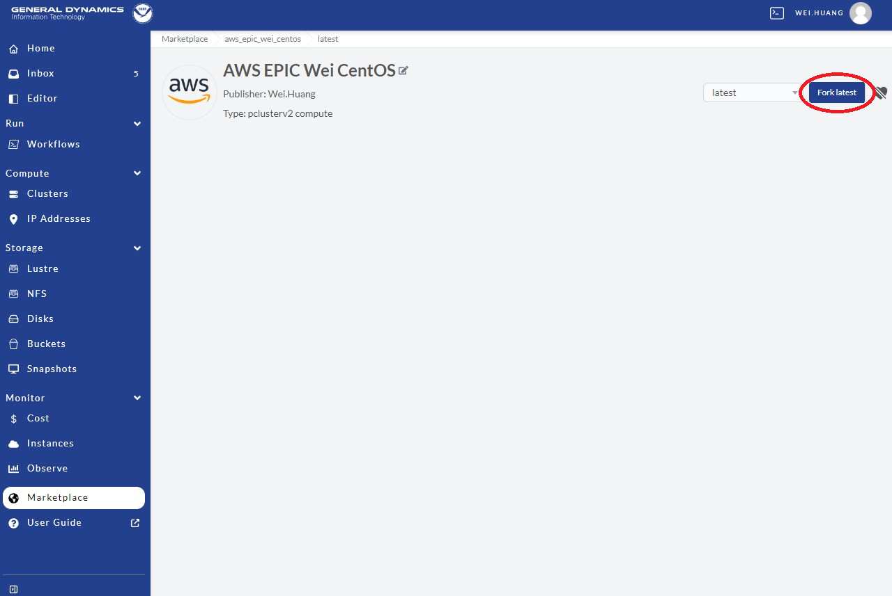
   
Please provide a unique name (box pointer by the red-arrow) for the instance.
Best practices suggest one that is clear, concise, and relevant to the application.
Click :red-text:`Fork` (in the red-circle) to fork an instance.

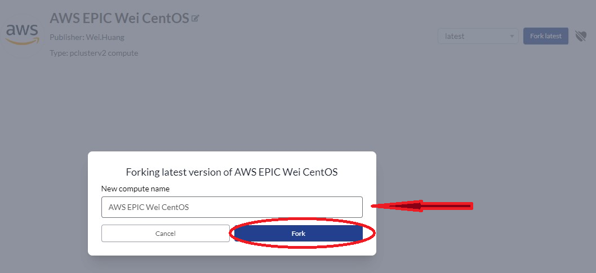

Now, an instance is forked, and it is time to configure the cluster.

1. Select a "Recource Account", usually it is: NOAA AWS Commercial Vault.
2. Select a "Group". Which will be something like: ca-epic, ca-sfs-emc, etc.
3. Copy and paste you Public key (.ssh/id_rsa.pub, .ssh/id_dsa.pu from your laptop).
4. Modify "User Bootstrap". If you are not use "ca-epic" group, please UNCOMMENT line 2.
5. Keep "health Check" as it is.

Click "Save Changes" at top-right as shown in read circle.

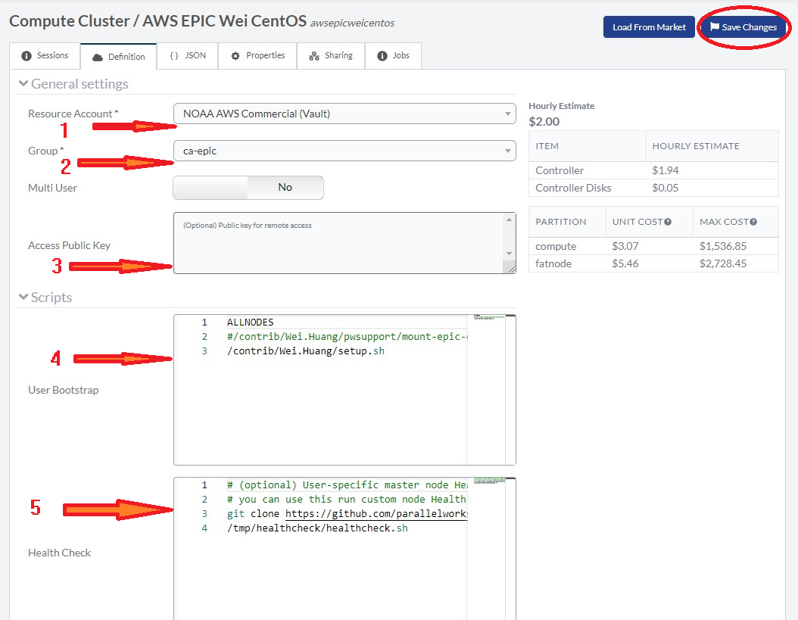

The NOAA ParallelWorks currently provides 3 CSPs:
**AWS** (Amazon Web Services), **Azure** (Microsoft Azure),
and **GCP** (Google Cloud Platform).
Existing clusters may also be modified.
Better practice is to fork from Marketplace with something similar to your requests.

******************************
Add CSP Lustre Filesystem
******************************

To run global-workflow on CSPs, we need to attached lustre filesystem as run directory.
Figure, we need to add/define our lustre filesystem, to do so,
navigate to the middle of noaa.parallel.works web-site left panel and select "Lutre" 
as pointed by red-arrow, and then click "AddStorage" at top-right as in the red-circle.

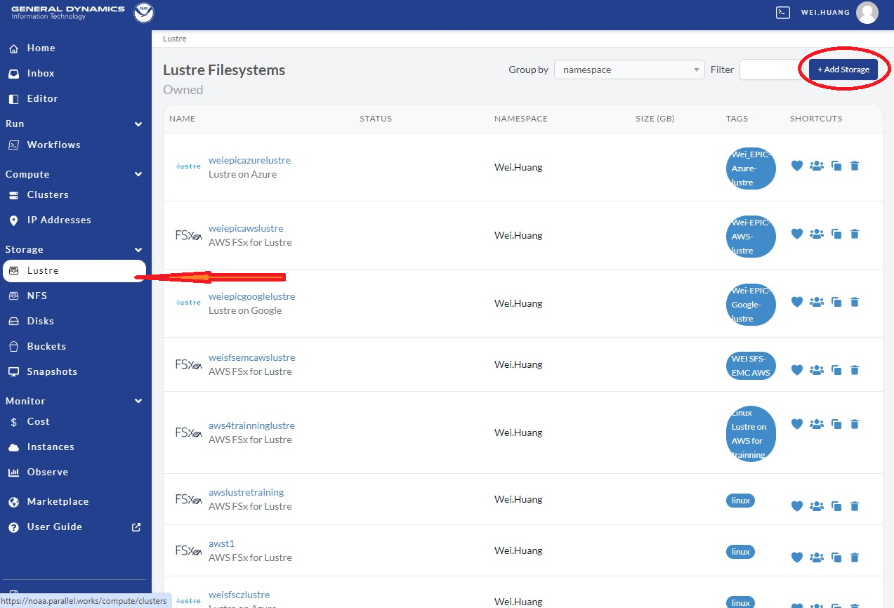

Select `FSx` for AWS FSx lustre filesystem as in red-circle.
Define the lustre with:

1. Clear and meaningfull `Resource name` as shown in red-arrow 1
2. Short sentice for `Decription` as shown in red-arrow 2
3. Choose **linux** for `Tag` as shown in red-arrow 3

Click "Add Storage" as in red-box at top-right corner.
This will create a "lustre" filesystem template.

.. image:: _static/noaacsp_lustre_2.png
	   
After create the template, we need to fill information for this lustre filesystem.
To do so, go to noaa.parallel.works web-site, click "Lustre" at left-panel as
indicated by red-arrow 1. Then select the filesystem as define above by `Resource name`
as shown in red-box. Here user can delete this resource if not needed by
click the trash-can as pointed by red-arrow 2.

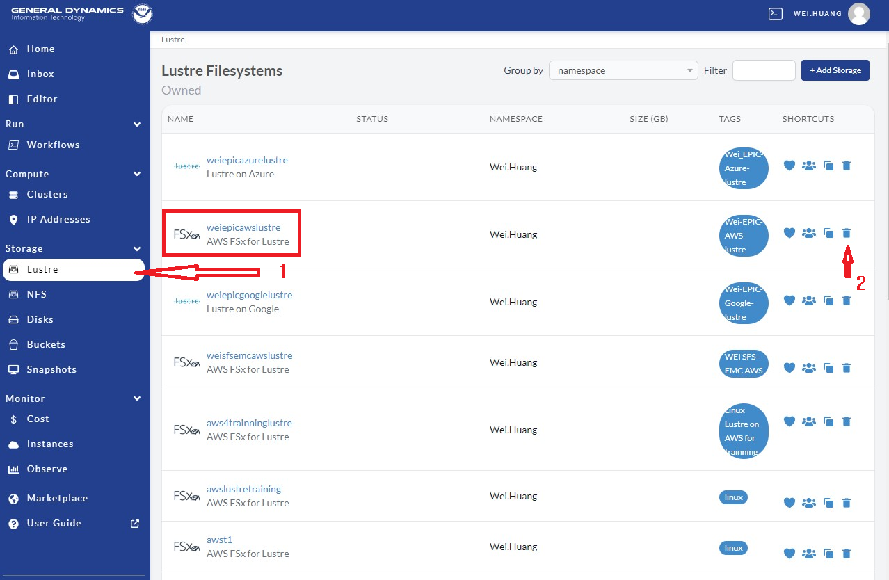

By click the filesystme in the red-box of the above image,
users led to the lustre definition page.

1. Choose a size in the `Storage Capacity(GB)` box as pointed by red-arrow 1.
   There is a minium of 1200 by AWS. For C48 ATM/GEFS case this will be enough.
   For SFS-C96 case, or C768 ATM/S2S case it should probably increase to 12000.
2. For `File System Deployment`, choose "SCRATCH_2" for now as by red-arrow 2.
   Do not use SCRATCH_1, as it is used for test by PW.
3. Choose **NONE** for `File System Compression` as pointed by red-arrow 3.
   Only choose LZ4 if you understand what it means.
4. Leave "S2 Import Path" and "S3 Export Path" black for now.
5. Click **Save Changes** in red-circle to save the definition/(changes made).

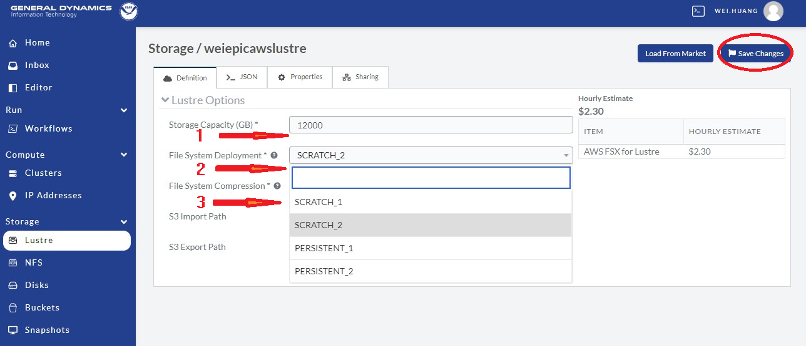

For the storage to be allocated for the global-workflow application,
it is suggested that the ``Mount Point`` be ``/lustre``. Once the storage
has been configured, click the ``+ Add Attached Storage`` button in
the upper-right corner. This is illustrated in the following image.

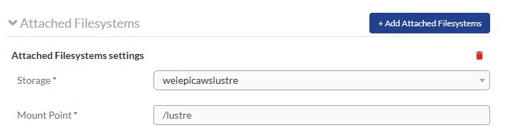

******************************
Attach CSP Lustre Filesystem
******************************

Now we need to attach the defined filesystem to our cluster.
Go back to our noaa.parallel.works web-site, and click `Cluster`
as shown in figuer below, then select the cluster "AWS EPIC Wei CentOS example"
(it should be your own cluster) cluster as show in red-box.
Note, one can remove/delete this cluster if no longer needed by
click the trash-can shown in the red-circle at right.

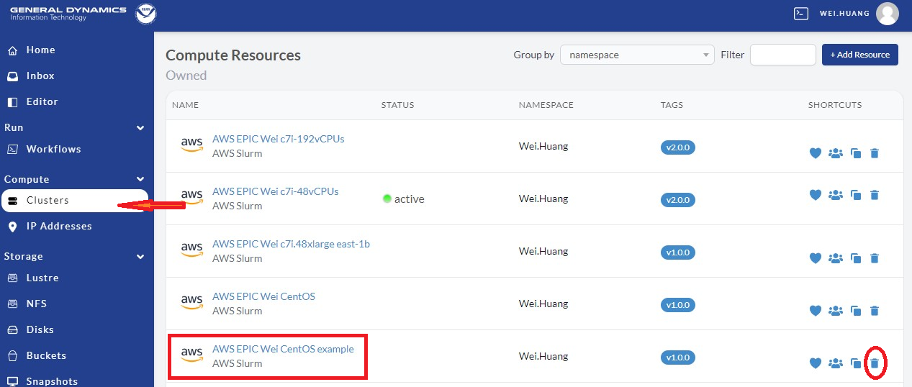

When get into the cluster page, click the `Definition` in the top menu as
in the red-box. When finished, remeber to clicke `Save Changes` to save
the changes.

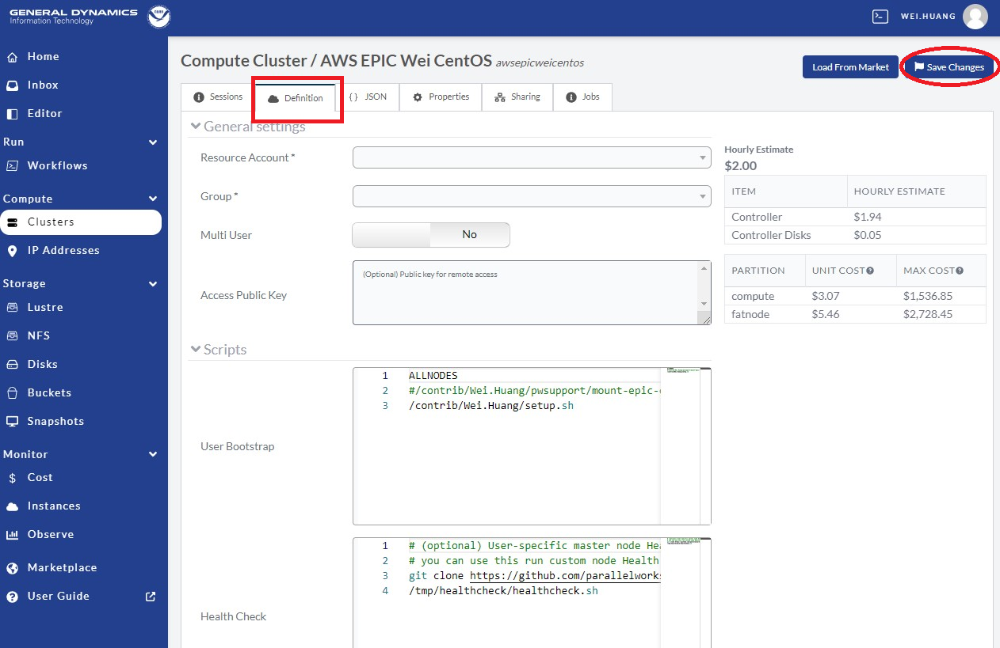

Scrow down to the bottom, and click `Add Attached Filesystems` as in the red-circle.

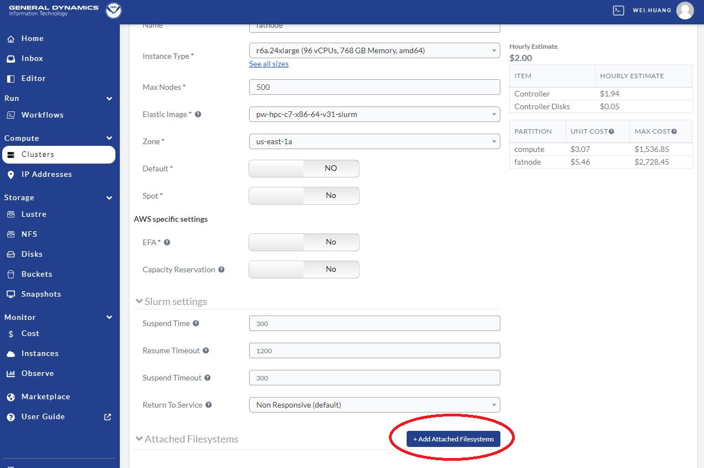

After click `Add Attached Filesystems`, one `Attached Filesystems settings` will appear.

1. In the `Storage` box, select the lustre filesystem defined above, as in red-arrow 1.
2. In the `Mount Point` box, name it `/lustre` (the common and default choice) as pointed by red-arrow 2.
   If you choose a different name, make sure to make the Global-Workflow setup step
   use the name chosen here.

If you have a `S3 bucket`, one can attached as:

3. In the `Storage` box, select the bucket you want to use, as in red-arrow 3.
4. In the `Mount Point` box, name it `/bucket` (the common and default choice) as pointed by red-arrow 4.

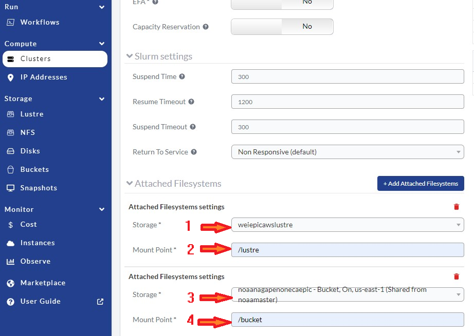

Always remember to click `Save Changes` after making any changes to the cluster.

**************************
Using the NOAA CSP Cluster
**************************

To activate the cluster, click the `cluster` at right panel of the noaa.parallel.works web-site,
as point by the red-arrow. Then click the `Sessions` button in red-square, and than click the
button in red-circle. The cluster status is denoted by the color-coded button
on the right: red, stopped; orange, requested; green, active. The amount of time required to start
the cluster varies and not immediate and may take several minutes for the cluster to become active.

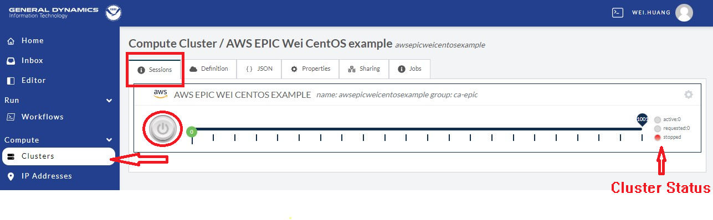

when the cluster is activate, user will see:
1. Green dot means the cluster is active, pointed by red-arrow 1.
2. Green dot means the cluster is active, pointed by red-arrow 2.
3. Green button means the cluster is active, pointed by red-arrow 3.
4. Click the blue-square with arrow inside pointed by red-arrow 4 will copy the cluster's IP into clipboard,
   which you can open a laptop xterm/window, and do `ssh username@the-ip-address` in the xterm window will connect you
   to the AWS cluster, and you can do you work there.
5. Which is the `username@the-ip-address`, or your AWS PW cluster. Click it, will have a PW web terminal appear in the
   bottom of the web-site, which you can work on this terminal to use your AWS cluster.

Please note, as soon as the cluster is activated, AWS/PW starts charging you for use the cluster.
As this cluster is exclusive for yourself, AWS keep charging you as long as the cluster is active.
For running global-workflow, one need to keep the cluster active if there is any rocoto jobs running,
as rocoto is using `crontab`, which needs the cluster active all the time, or the crontab job will be terminated.

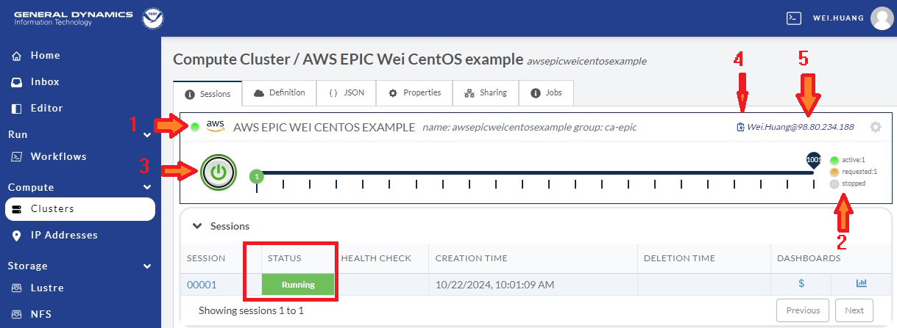

After finish your work on the AWS cluster, one should terminate/stop the cluster, unless you have reasons to keep it active.
To stop/terminate the cluster, go to the cluster session, and click the `green` button. A window pop up, and click the
red `Turn Off` button to switch off the cluster. 

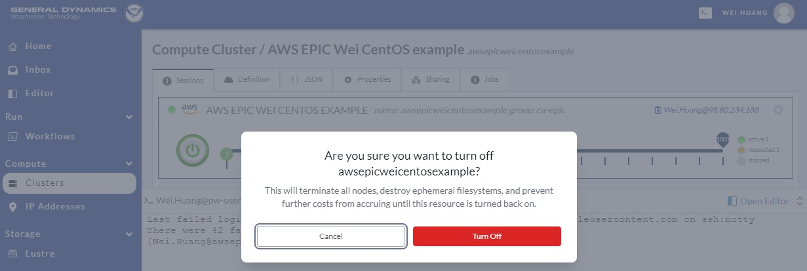

***************************
Running the Global Workflow
***************************

Assume you have a AWS cluster running, after login to the cluster through `ssh` from your laptop terminal,
or access the cluster from your web terminal, one can start clone, compile, and run global-workflow.
1. clone global-workflow( assume you have setup access to githup):
.. code-block:: bash
   cd /contrib/$USER   #you should have a username, and have a directory at /contrib where we save our permanent files.
   git clone --recursive git@github.com:NOAA-EMC/global-workflow.git
   #or the develop form at EPIC:
   git clone --recursive git@github.com:NOAA-EPIC/global-workflow-cloud.git
2. compile global-workflow:
.. code-block:: bash
   cd /contrib/$USER/global-workflow
   cd sorc
   build_all.sh   # or similar command to compile for gefs, or others.
   link_workflow.sh  # after build_all.sh finished successfully

As users may define a very small cluster as controoler, one may use a script similar to this to compile in compute node.

.. code-block:: bash
   #!/bin/bash

   #SBATCH --job-name=compile

   #SBATCH --account=$USER

   #SBATCH --qos=batch

   #SBATCH --partition=compute

   #SBATCH -t 04:15:00

   #SBATCH --nodes=1

   #SBATCH -o compile.%J.log

   #SBATCH --exclusive

   set -x

   gwhome=/contrib/Wei.Huang/src/global-workflow-cloud
   cd ${gwhome}/sorc
   source ${gwhome}/workflow/gw_setup.sh

   #build_all.sh

   build_all.sh -w

   link_workflow.sh

Save the above lines in a file, say, com.slurm, and submit this job with command "sbatch com.slurm"

3. run global-workflow C48 ATM test case (assume user has /lustre filesystem attached):
.. code-block:: bash
   cd /contrib/$USER/global-workflow
   
   HPC_ACCOUNT=${USER} pslot=c48atm RUNTESTS=/lustre/$USER/run \
        ./workflow/create_experiment.py \
        --yaml ci/cases/pr/C48_ATM.yaml

   cd /lustre/$USER/run/EXPDIR/c48atm
   crontab c48atm

EPIC has copied the common used data to AWS, and the current code has setup to use those data.
If user wants to run own case, user needs to make changes to the IC path and others to make it work.
The execution of the global-workflow should now follow the same steps
as those for the RDHPCS on-premise hosts.

